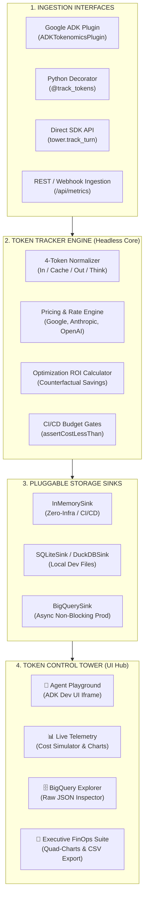

# 🧩 Architecture & Modularity Guide
### *Hexagonal / Decoupled Design of the Tokenomics Framework*

The **`adk-tokenomics`** platform is built around **strict separation of concerns**. The computation engine, telemetry storage, ingestion adapters, and visual dashboard operate as independent modules that can be mixed and matched across different environments.

---

## 🏛️ Modular System Architecture



---

## 📦 The 4 Decoupled Layers

### 1. Ingestion Interfaces
Adapters that intercept turn events from different AI agent runtimes:
- **`ADKTokenomicsPlugin`:** Intercepts Google ADK session turns and automatically extracts `usage_metadata` (prompt tokens, cached tokens, candidate tokens, thought tokens).
- **`@track_tokens`:** Function decorator that wraps custom LLM calls, LangChain runnables, or LlamaIndex query engines.
- **Direct API:** `tower.track_turn(...)` or `tracker.record_turn(...)` for manual or webhook-based instrumentation.

### 2. Token Tracker Engine (`tokenomics.core`)
A lightweight, zero-dependency computation engine:
- **Normalized 4-Token Accounting:** Standardizes tokens across Google Gemini, Anthropic Claude, and OpenAI.
- **Dynamic Pricing:** Resolves rate cards from `models_config.json` with support for custom discounts or enterprise tiers.
- **Optimization ROI Calculation:** Quantifies dollar ($) and percent (%) savings generated by Context Caching and History Compaction against hypothetical uncached baselines.
- **CI/CD Assertions:** Headless testing assertions for PyTest and Unittest.

### 3. Pluggable Storage Sinks (`tokenomics.core.sinks`)
Storage backends implement the `BaseSink` abstract interface:
- **`InMemorySink`:** Zero-setup in-memory buffer, perfect for fast unit testing and local prototyping.
- **`SQLiteSink` / `DuckDBSink`:** Embedded local file storage for multi-session development and staging.
- **`BigQuerySink`:** Production-grade sink with an asynchronous background worker (`queue.Queue` + worker thread) that flushes in batches without blocking agent execution or adding latency.

### 4. Token Control Tower (`tokenomics.server` / Web UI)
A glassmorphic visualization and decision dashboard communicating via REST APIs:
- **Agent Playground:** Interactive chat with live turn inspection.
- **Live Telemetry & Cost Simulator:** Real-time optimization comparisons and what-if rate adjustments.
- **BigQuery Explorer:** Parameterized table querying and raw record inspection.
- **Executive FinOps Suite:** Macroeconomic quad-charts, unit economics ($/1M tokens), and 1-click CSV/JSON reporting.

---

## 🎯 3 Standalone Ways to Use the Framework

Because of this modular design, you only use the parts you need:

---

### Scenario A: Headless CI/CD Testing (No UI, Zero Overhead)
*Use Case: Enforce token budgets and caching efficiency in automated test pipelines.*

```python
import unittest
from tokenomics import TokenomicsTestCase

class TestAgentRegression(TokenomicsTestCase):
    def test_summary_turn_budget(self):
        with self.track_tokens() as tracker:
            # Run your agent logic
            tracker.record_turn(
                session_id="ci_run",
                app_name="support_bot",
                model_name="publishers/google/models/gemini-3.5-flash",
                user_query="Summarize document",
                agent_response="Summary...",
                input_tokens=4000,
                cached_tokens=20000,
                output_tokens=500,
                thinking_tokens=100
            )

            # Automated CI/CD Budget Assertions
            self.assertCostLessThan(tracker, max_dollars=0.005)
            self.assertCacheHitRatioGreaterThan(tracker, min_ratio_pct=75.0)
            self.assertTokenBudget(tracker, max_tokens=30000)
```

---

### Scenario B: Embedded Developer Workbench (Local UI)
*Use Case: Interactive local debugging, chat playground, and rate card experimentation.*

```python
from tokenomics import TokenControlTower

# Zero cloud setup — runs entirely locally with in-memory telemetry
tower = TokenControlTower(mode="prototype")

# Connect to your agent
tower.track_turn(...)

# Boot up the local Web Control Tower on localhost:8080
tower.launch_ui(port=8080)
```

---

### Scenario C: Standalone Enterprise Production FinOps Portal
*Use Case: Centralized leadership dashboard connected to an enterprise BigQuery dataset.*

```python
import os
from tokenomics import TokenControlTower, provision_bigquery_table

os.environ["GOOGLE_CLOUD_PROJECT"] = "enterprise-gcp-project"

# 1. Ensure BigQuery partitioned table exists
provision_bigquery_table(
    project_id="enterprise-gcp-project",
    dataset_id="ai_finops_ds",
    table_id="token_consumption_logs"
)

# 2. Initialize production tower with background streaming
tower = TokenControlTower(
    mode="prod",
    dataset_id="ai_finops_ds",
    table_id="token_consumption_logs"
)
```

---

## 🔄 Custom Sinks & Extensibility

You can implement a custom storage sink (e.g. PostgreSQL, Redis, Datadog) by subclassing `BaseSink`:

```python
from tokenomics.core.sinks import BaseSink
from typing import Dict, Any, List

class CustomPostgresSink(BaseSink):
    def __init__(self, connection_string: str):
        self.conn = connect_db(connection_string)

    def write_turn(self, record: Dict[str, Any]):
        # Custom insert logic into PostgreSQL
        self.conn.execute("INSERT INTO token_logs VALUES (...)", record)

    def fetch_recent(self, limit: int = 50) -> List[Dict[str, Any]]:
        # Custom query logic
        return self.conn.query("SELECT * FROM token_logs ORDER BY timestamp DESC LIMIT %s", limit)
```
