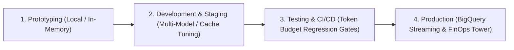

# 🚀 Plug & Play Tokenomics & Control Tower Framework Guide
### *Turnkey LLM Token Economics, Context Optimization & FinOps for AI Agents*

This guide details how enterprise teams can integrate the **`adk-tokenomics`** Framework into their AI agent development lifecycle—from **1-line local Prototyping** to **Automated CI/CD Regression Testing** and **Enterprise Production FinOps**.

---

## 🧭 The 4-Stage Lifecycle Architecture



| Lifecycle Stage | Mode | Telemetry Sink | Key Developer Capability |
| :--- | :--- | :--- | :--- |
| **1. Prototyping** | `mode="prototype"` | `InMemorySink` | 1-line setup, Zero GCP setup, embedded local UI on `localhost:8080` |
| **2. Development** | `mode="dev"` | `DuckDBSink` / `SQLite` | Architecture experimentation (Naive vs Caching vs Compaction vs Skills) |
| **3. Testing & CI/CD**| `mode="test"` | In-Memory Assertions | PyTest / Unittest automated token & cost regression assertions in CI |
| **4. Production** | `mode="prod"` | `BigQuerySink` (Async) | Non-blocking streaming, partitioned tables, Executive FinOps Quad-Charts |

---

## 🛠️ Stage 1: Prototyping (Zero-Infra / Local UI)

For quick hackathons or local prototyping where you want instant visibility into token consumption without setting up GCP permissions or databases.

### 1-Line Drop-in Code:
```python
from tokenomics import TokenControlTower

# Initialize in prototype mode (zero-infra in-memory telemetry)
tower = TokenControlTower(mode="prototype")

# Track a turn
tower.track_turn(
    session_id="session_demo",
    app_name="prototype_bot",
    model_name="publishers/google/models/gemini-3.5-flash",
    user_query="Analyze this contract",
    agent_response="Here is the executive summary...",
    input_tokens=15000,
    cached_tokens=45000,
    output_tokens=1200,
    thinking_tokens=500
)

# Launch the interactive local Web UI on port 8080
tower.launch_ui(port=8080)
```

---

## ⚡ Stage 2: Development & Staging (ADK Agent & Multi-Model Integration)

Integrate directly with Google ADK (Agent Development Kit) or custom multi-agent architectures to benchmark context optimization strategies.

### A. Attaching the ADK Plugin:
```python
from google.adk.agents import Agent
from tokenomics import TokenControlTower

tower = TokenControlTower(mode="dev")
adk_plugin = tower.create_adk_plugin(app_name="customer_support_agent")

# Attach plugin to ADK Agent or Runner
agent = Agent(
    name="customer_support_agent",
    model="gemini-3.5-flash",
    instruction="You are a helpful customer assistant...",
    tools=[...]
)
```

### B. Function Decorator for Custom Pipelines:
```python
from tokenomics import track_tokens

@track_tokens(app_name="financial_analyst", model_name="publishers/google/models/gemini-3.7-flash")
def execute_market_research(query: str):
    # Your custom LLM calling code or LangChain / LlamaIndex chain
    return response
```

---

## 🧪 Stage 3: Testing & CI/CD Regression Gates (Token & Cost Assertions)

Prevent token inflation and cost regressions before code merges to `main`. Enforce financial token limits in your test suite.

### Automated Unittest / PyTest Integration:
```python
from tokenomics import TokenomicsTestCase

class TestAgentTokenomicsRegression(TokenomicsTestCase):
    
    def test_customer_turn_cost_and_caching_roi(self):
        with self.track_tokens() as tracker:
            # 1. Execute your agent action
            tracker.record_turn(
                session_id="test_run_1",
                app_name="caching_agent",
                model_name="publishers/google/models/gemini-3.5-flash",
                user_query="Explain quarterly results",
                agent_response="Revenue grew by 15%...",
                input_tokens=5000,
                cached_tokens=25000,
                output_tokens=600,
                thinking_tokens=150
            )

            # 2. Automated Financial & Unit Economic Assertions
            self.assertCostLessThan(tracker, max_dollars=0.005)              # Gate: Max spend <= $0.005
            self.assertCacheHitRatioGreaterThan(tracker, min_ratio_pct=75.0)  # Gate: Cache ratio >= 75%
            self.assertTokenBudget(tracker, max_tokens=35000)                # Gate: Max total tokens <= 35,000
            self.assertThinkingTokensWithin(tracker, min_tokens=50, max_tokens=1000)
```

---

## 🏢 Stage 4: Production & Enterprise FinOps (Cloud Scale)

Connect to production Google Cloud BigQuery with asynchronous, non-blocking telemetry streaming.

### A. One-Click BigQuery Provisioning:
```python
from tokenomics import provision_bigquery_table

# Automatically provisions partitioned & clustered BigQuery table
provision_bigquery_table(
    project_id="my-company-gcp-project",
    dataset_id="ai_finops_ds",
    table_id="token_consumption_logs"
)
```

### B. Production Initialization:
```python
import os
from tokenomics import TokenControlTower

os.environ["GOOGLE_CLOUD_PROJECT"] = "my-company-gcp-project"

tower = TokenControlTower(
    mode="prod",
    dataset_id="ai_finops_ds",
    table_id="token_consumption_logs"
)
```

### C. BigQuery Partitioned Table Schema:
```sql
CREATE TABLE IF NOT EXISTS `my-company-gcp-project.ai_finops_ds.token_consumption_logs` (
    timestamp TIMESTAMP NOT NULL,
    session_id STRING,
    app_name STRING,
    model_name STRING,
    user_query STRING,
    agent_response STRING,
    input_tokens INT64,
    cached_tokens INT64,
    output_tokens INT64,
    thinking_tokens INT64,
    total_cost FLOAT64,
    tools_called ARRAY<STRING>,
    skills_active ARRAY<STRING>,
    raw_json STRING
)
PARTITION BY DATE(timestamp)
CLUSTER BY app_name, model_name, session_id;
```

---

## 📦 Package Distribution & Installation

Customers can install and use the framework via standard Python packaging:

```bash
# Install from internal PyPI or Git repository
pip install git+https://github.com/karthecoder/adk-tokenomics.git
```
