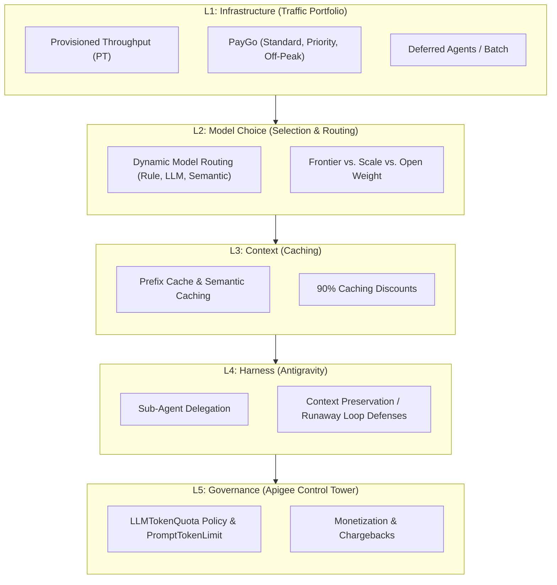
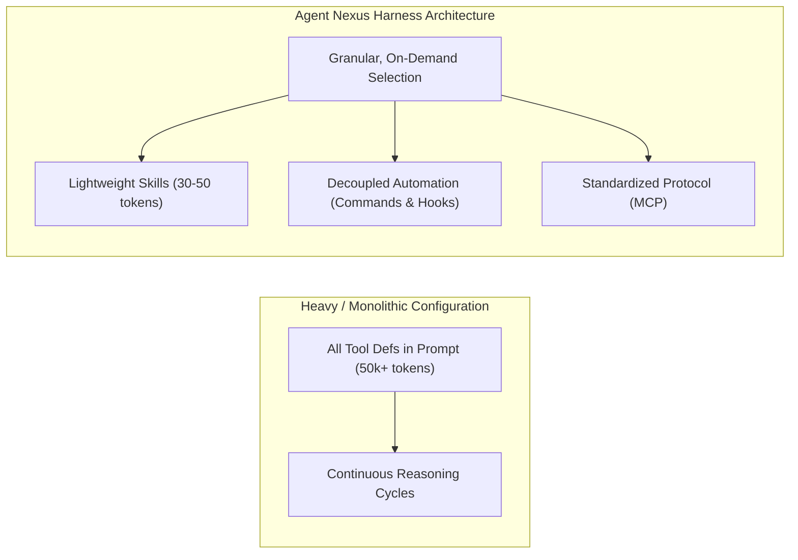

# Agent Nexus: The 5-Layer AI Token Optimization Demo

This document outlines interactive demo concepts designed to showcase Google Cloud's **5-Layer AI Token Optimization Framework** (Agent Nexus). This framework represents Google Cloud's end-to-end stack for ensuring "every single token counts," powered by **Gemini Models, the Antigravity Harness, and the Apigee API Platform**.



---

## 🎯 Target Audience Mapping & Framework Alignment

| Layer | Value Proposition | Primary Persona | Technical Enablers (Google Cloud Stack) |
| :--- | :--- | :--- | :--- |
| **L5: Governance** | Enforce user-level token quotas & prevent runaway agent costs. | **FinOps & Compliance Leads** | **Apigee (LLMTokenQuota, PromptTokenLimit, Monetization & Chargebacks)** |
| **L4: Harness** | Co-optimized 12x agent execution speed advantage & loop defense. | **Chief AI Officers (CAIOs)** | **Antigravity Harness** |
| **L3: Context** | 90% cost reduction on prompt prefixes / semantic matches. | **Architects & Developers** | **Vertex AI Context Caching & Apigee Semantic Caching** |
| **L2: Model** | Dynamic task decomposition & intent-based routing. | **CTOs & Tech Directors** | **Apigee (Dynamic Model Routing) & Gemini 3.5 Tiers** |
| **L1: Infrastructure** | Optimized capacity booking for variable patterns. | **FinOps / Procurement** | **Provisioned Throughput (PT) with Burst PayGo, Deferred Agents** |

---

## 💡 The Unified Demo Concept: "Agent Nexus Control Center"
Instead of disjointed tools, we recommend building a unified, interactive Web App dashboard styled as **"Agent Nexus: Token Control Tower"** using modern dark-mode, high-fidelity UI design. Users can toggle through the 5 layers tab-by-tab to see how their tokens are optimized.

---

### 🌐 Layer 1: Infrastructure Efficiency Simulator
Demonstrates how to match consumption options to variable enterprise traffic patterns.

* **The Simulation:**
  - Renders a 24-hour interactive timeline chart showing simulated task volume (TPM).
  - Users can toggle different capacity profiles:
    - Naive Profile (Unreserved Peak PayGo) -> high costs.
    - Flat PT Profile -> high waste during low periods.
    - **Optimized Agent Nexus Profile** -> **Provisioned Throughput (PT)** as the baseload, **Standard/Priority PayGo** for peak burst spikes, and **Deferred Agents** to run low-priority tasks at a 50% discount.
* **Interactive Elements:**
  - **Off-Peak Timezone Picker:** User selects their home timezone (e.g., Tokyo, Singapore, Bangalore). The timeline dynamically shifts, highlighting how their daytime working hours align with US Pacific off-peak hours (3 PM - 9 PM PST) to automatically grant **Off-Peak PayGo (50% off)**.

---

### 🔀 Layer 2: Model Choice & Dynamic Routing Visualizer
Illustrates how intent-driven dynamic routing decomposes agent requests into optimized sub-tasks, managed by **Apigee API Platform**.

```mermaid
sequenceDiagram
    autonumber
    Agent Request->>Apigee Gateway: Tagged with Agent & User ID
    Apigee Gateway->>Apigee Gateway: Check Semantic Cache (Reuse meaning)
    Apigee Gateway->>Apigee Gateway: Dynamic Model Routing (Analyze & Split)
    rect rgb(220, 240, 255)
        Note right of Apigee Gateway: Gateway evaluates task intent (Rule-Based, LLM, or Semantic)
    end
    Apigee Gateway-->>Flash-Lite: Route formatting task (Utility)
    Apigee Gateway-->>Flash: Route classification task (Utility)
    Apigee Gateway-->>3.1 Pro: Route complex reasoning task (Frontier)
    Flash-Lite-->>Agentic Dashboard: Return & Assemble
    Flash-->>Agentic Dashboard: Return & Assemble
    3.1 Pro-->>Agentic Dashboard: Return & Assemble
```

* **Interactive Elements:**
  - **Architectural Mode Toggle (Agent Call vs. Model Call):**
    - A switch that allows users to toggle between **Managed Agent Mode** (Scenario 1) and **Client-Side Model Mode** (Scenario 2).
    - **Visual Flow Animation:**
      - *Agent Mode:* Shows a single connection from the client to Google Cloud. The reasoning loop, memory, and tool executions are contained entirely inside Google's hosted **Agent Sandbox**.
      - *Model Mode:* Shows the **Agent Sandbox** on the client side, orchestrating and making multiple consecutive network trips to call the Gemini model API endpoint for each loop.
    - **Code Playground Sync:** Displays the corresponding Python SDK initialization scripts side-by-side:
      - *Agent call:* `session = client.interactions.create(agent="deep-research-pro...")`
      - *Model call:* `session = client.interactions.create_session(model="gemini-3.5-flash...")`
  - **Routing Pattern Selector:** Dropdown to switch between **Rule-Based**, **LLM-Based**, and **Semantic Routing** policies configured in Apigee.
  - **Live Step-by-Step Pipeline:** User inputs an agent request (e.g., *"Read repository files, list function sizes, and generate a refactoring report"*).
  - The UI animates the request passing through:
    1. *Request Initiated* -> 2. *Identity Tagging* -> 3. *Apigee AI Gateway* -> 4. *Model Routing* (splits into sub-tasks) -> 5. *Agentic Dashboard*.
  - Cost and latency meters dynamically update, proving **60%+ TCO reduction** with identical quality benchmarks.


---

### 💾 Layer 3: Context Optimization Playpen
Demonstrates how precision context design restricts inputs to hyper-relevant data, driving down compute and token overhead.

* **Interactive Elements:**
  - **The "Token Reduction" Checkbox Panel:** A live interactive console where developers can toggle five distinct context optimization strategies on a sample large-context codebase query (e.g. 500k tokens baseline):
    1. **Prompt Caching:** Isolates dynamic data at the end of the prompt while keeping system rules and definitions static, triggering host-side caching to reduce input token cost by **~90%**.
    2. **Sliding Window:** Programmatically discards or summarizes the oldest dialogue turns as a session progresses, capping active memory to ensure per-turn token volume remains flat.
    3. **Memory Distillation:** Periodically compresses verbose histories to preserve essential business context while discarding repetitive background noise.
    4. **Clean Serialization:** Converts heavy, verbose data structures (raw JSON, XML, or HTML) into clean, stripped-down Markdown before sending them to the model.
    5. **Semantic Chunking:** Retrieves only the exact, hyper-relevant sentences needed to resolve a query, drastically lowering the token volume processed per database call.
  - **Real-Time Token Bar Chart:** Displays a dynamic bar chart that visually shrinks (e.g., from 500k tokens down to 8k tokens) as the user checks each optimization box, demonstrating the direct TCO saving.

---

### ⚙️ Layer 4: Antigravity Agent Harness & Extension Analyzer
Demonstrates how the **Antigravity Harness** coordinates execution, standardizes tool communication, and minimizes token overhead via modular extensions.



* **Interactive Elements:**
  - **Extension Type Token Cost Calculator:** An interactive comparison card mapping different modular extensions (Slide 47):
    - **Skills:** Teach procedures and domain expertise (30-50 tokens/skill, very low).
    - **Plugins:** Bundle and share team standardization (Sum of contents).
    - **Hooks & Commands:** Automate actions and prompt shortcuts (Minimal token overhead).
    - **MCP (Model Context Protocol):** Connect tools for external integrations (50k+ tokens overhead, highly variable).
  - **Execution Path Visualizer:** Shows an animation of the harness routing tasks:
    - Illustrates **Granular, On-Demand Selection**: Shows the harness loading specific lightweight Skills only when needed, keeping the context window clean compared to stuffing all tools into the prompt.
    - Illustrates **Decoupled Automation**: Animates how abstracting actions into Commands and Hooks handles routing logic outside the expensive LLM context to prevent redundant token consumption.
    - Illustrates **Sub-Agent Delegation**: Visualizes the coordinator model directing execution, showing the **12x speed advantage** when co-optimized with Gemini 3.5 Flash.

---

### 🛡️ Layer 5: Governance Cost Control Tower
The administrative dashboard demonstrating how **Apigee API Platform** policies enforce user-level token quotas, prevent runaway costs, and enable internal chargebacks.

* **Interactive Elements:**
  - **Apigee Policy Configurator:**
    - **LLMTokenQuota Policy:** Set strict token consumption ceilings per user or per agent ID (e.g., 500k tokens per user per day). Visualizes the dashboard blocking traffic once the limit is breached, preventing budget blowouts.
    - **PromptTokenLimit Policy:** Set limits on prompt message size and rate (TPM/RPM) to block token abuse and potential agentic infinite loops at the gateway tier.
    - **Monetization & Chargebacks Dashboard:** Displays detailed consumption analytics and cost attribution maps grouped by Department, Agent ID, or User, facilitating seamless internal financial auditing.
  - **Runaway Loop Defense Trigger:** Simulates a compilation error loop. The Apigee PromptTokenLimit policy immediately throttles the repeating requests, while the harness halts execution, showcasing layered, bulletproof loop defense.
